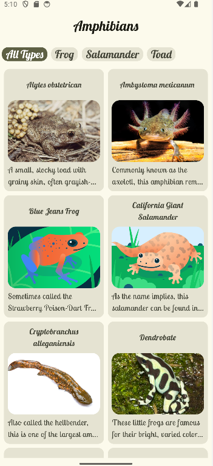
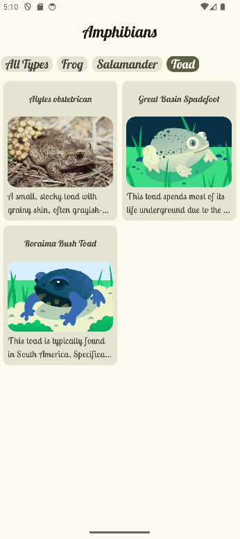
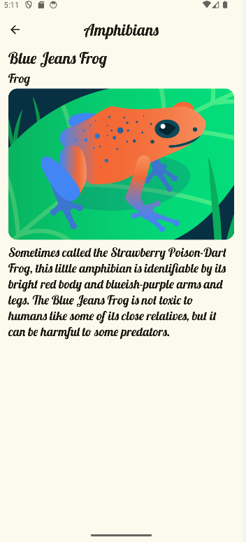

# 🐸 **Amphibians**
**Amphibians** is a modern Android application developed with Jetpack Compose, displaying a list of amphibians, along with details about them and their images using a REST API. The data will be retrieved from the Internet via a network request and will contain the name, type, description and image URL of each amphibian. The project follows Android development best practices, implementing MVVM architecture and using tools like Retrofit for network calls.

## ✅ **LAST MAJOR UPDATES**
   - Successfully merged local data and REST API data into a single list while maintaining correct type handling (String for API, Int for local).
   - Now the repository is responsible for merging and deduplicating amphibians, ensuring the ViewModel only deals with UI logic.
   - The amphibian type filter now correctly differentiates between local and API data, making filtering seamless.
   - Alphabetical sorting has been applied to both the amphibian list and the type filter list for better UX.
   - The disappearing TopAppBar issue when navigating to details has been fixed by dynamically adjusting scroll behavior.
   - Prevented ClassCastException When Clicking Local Data Items: Now all local amphibians are converted to API-style data before being used.

## ❌ **NEXT UPDATES**
   - Load API images dynamically instead of using placeholders for a more realistic data experience.
   - Reduce state updates that could cause UI lag, ensuring minimal recompositions.
   - Display a retry button or auto-retry mechanism when network issues occur.
   - Smooth & fluid UI/UX animations : improve LazyGrid scrolling performance, smooth TopAppBar and filter transitions, entry & exit animations for grid items.

## 📋 **Features**
   - 🐸 Display a list of Amphibians :

      - ✅ **DONE** Retrieves and displays a list of amphibians via a REST API.
      - 🟩 **IN PROGRESS** Shows detailed information including name, type, description, and image.

   - 🎨 **Modern and Fluid Interface**:

      - TopBar:
         - ✅ **DONE** Displays application name.
         - ✅ **DONE** Filter amphibians by type.
         - ✅ **DONE** Supports dynamic behavior on scroll.
      - Light/Dark Mode:
         - ✅ **DONE** Fully supports Material 3 with adaptive light and dark themes.

   - 🔄 **Real-time status management**:

      - ✅ **DONE** Uses a ViewModel to handle API responses and manage UI state.
      - ✅ **DONE** Implements StateFlow for reactive state updates.

   - 🚀 Performance and responsiveness:
   
      - 🟩 **IN PROGRESS** Implements lazy loading for efficient image handling. 
      - ❌ **NOT IMPLEMENTED** Uses Coil for fast and optimized image fetching.
      - 🟩 **IN PROGRESS** Supports smooth scrolling and responsive display.
      
   - 🛠 Error Handling & User Feedback:

      - 🟩 **IN PROGRESS** Displays appropriate error messages for network failures.
      - 🟩 **IN PROGRESS** Provides loading indicators for better UX.

## 🛠️ **Tech Stack**
   - **Kotlin**: Modern, concise language for Android development.
   - **Jetpack Compose**: Declarative UI toolkit for Android.
   - **Material 3**: Modern, accessible user interface.
   - **StateFlow**: Reactive state management for real-time updates.
   - **ViewModel**: MVVM architecture to separate business logic from user interface.
   - **Retrofit**: Effectuer des appels réseau vers l'API REST.
   - **State Management**: Gestion des états à l'aide de mutableStateOf.
   - **Coil** : Download, buffer, decode and cache images
   
## 🚀 **How to Use**
1. **Launch the App**:
   - Open the app on a Android device or emulator.
2. **Choose to filter by amphibian type or not**:
   - Use the top navigation bar to select a specific amphibian type.
   - Tap on "All Types" to reset the filter and view all amphibians.
3. **Navigate on the amphibians list**:
   - Scroll through the grid of amphibians to explore different species.
4. **Select amphibian**:
   - Tap on an amphibian card to view its detailed information.
5. **Return to home screen**:
   - Tap the back arrow in the top bar to return to the amphibians list.
6. **Enjoy the application**:
   - Explore, learn, and discover fascinating amphibians.

## 📸 **Screenshots**
- **Home screen**:

   

- **Filtered home screen**:

   

- **Details screen**:

   

## 🤝 **Contributions**
Contributions are welcome! Feel free to fork the repository and submit a pull request for new features or bug fixes.✅🟩❌